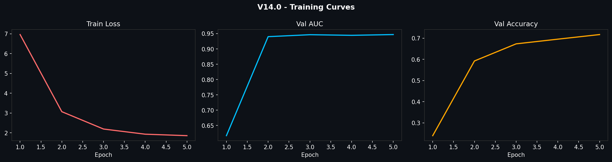
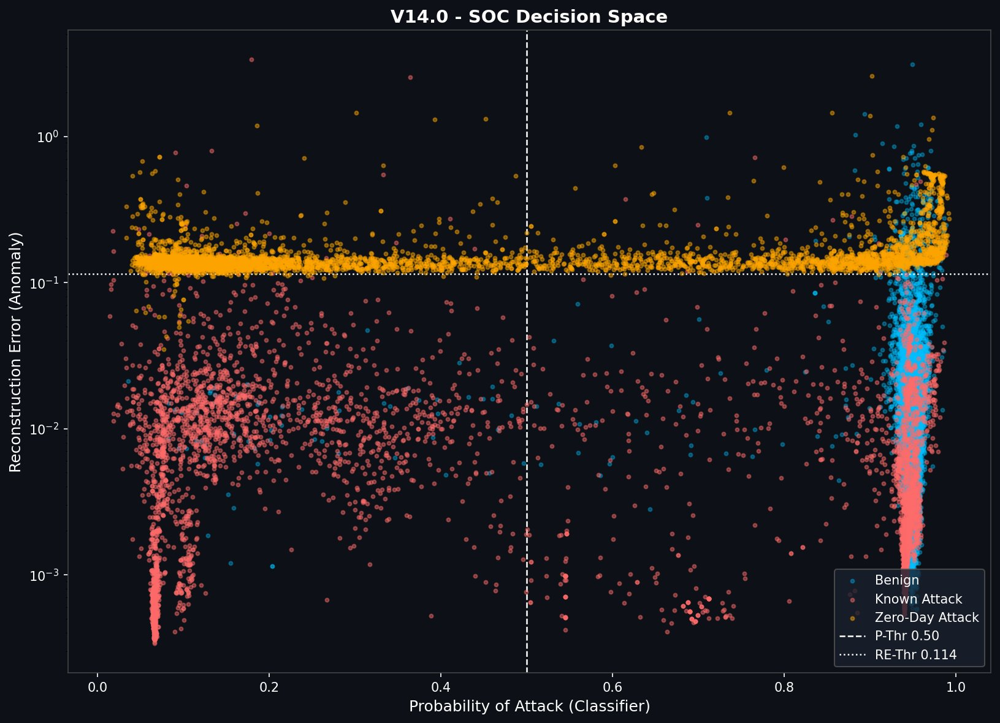
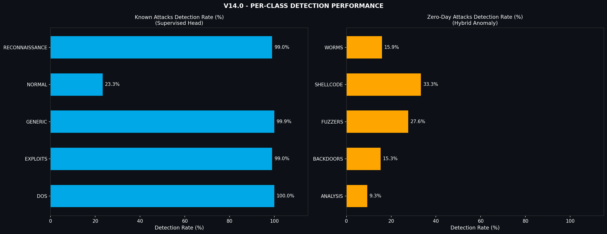
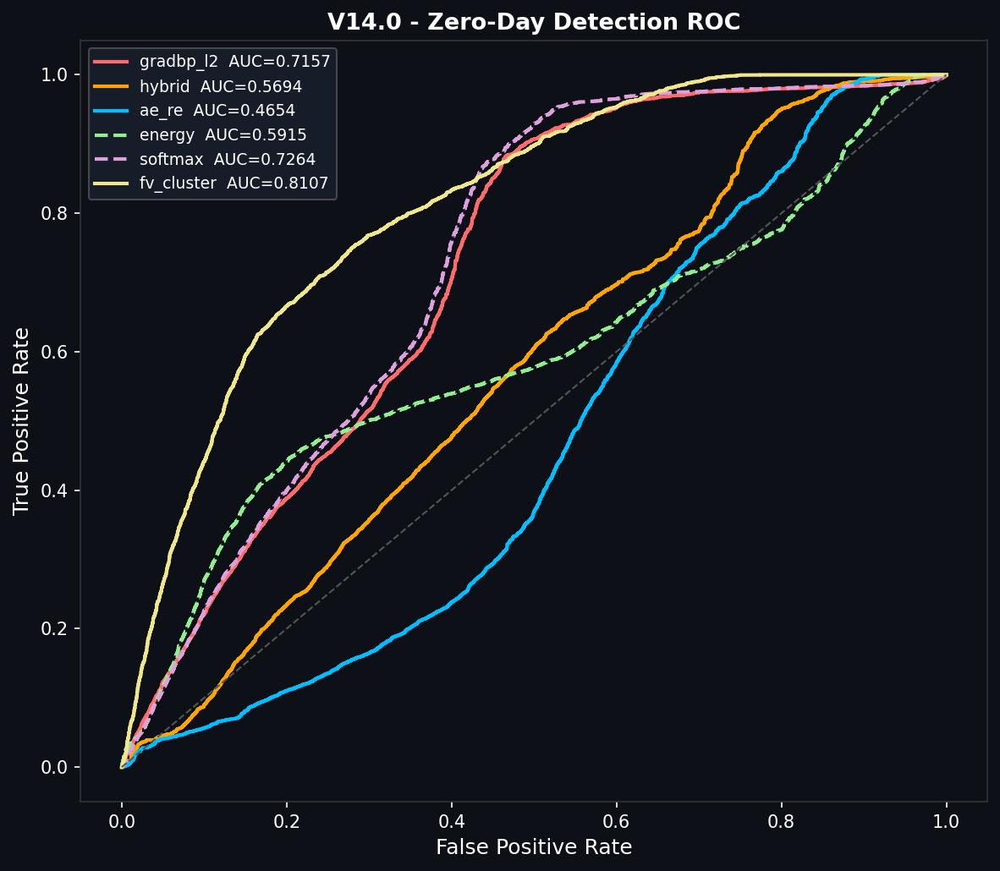
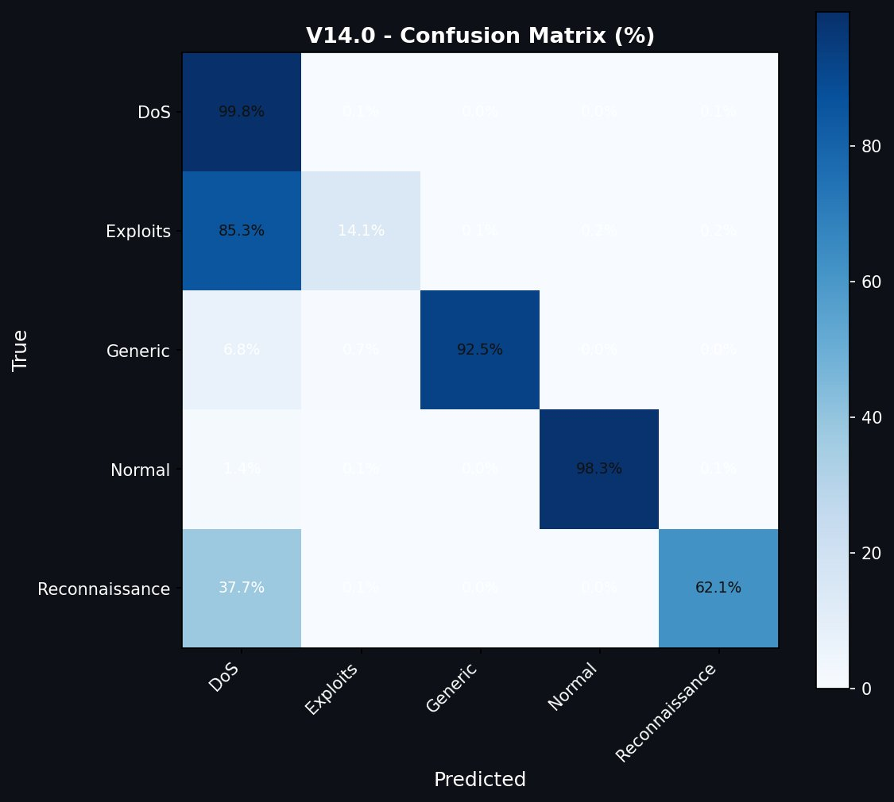

# 🛡️ IDS v14.0 — Hybrid Anomaly + GradBP Intrusion Detection System

> **Dataset:** UNSW-NB15 | **Framework:** PyTorch | **Task:** Known Attack Classification + Zero-Day Detection

[](https://python.org)
[](https://pytorch.org)
[](https://research.unsw.edu.au/projects/unsw-nb15-dataset)
[](LICENSE)

---

## 📋 Table of Contents

- [Overview](#overview)
- [Architecture](#architecture)
- [Results](#results)
- [Project Structure](#project-structure)
- [Quick Start](#quick-start)
- [Configuration](#configuration)
- [Plots](#plots)
- [Improvements over v13](#improvements-over-v13)
- [Citation](#citation)

---

## Overview

IDS v14.0 is a **hybrid intrusion detection system** combining:

- **Supervised Classifier** — ResNet-style backbone with FocalLoss for known attack classification (DoS, Exploits, Reconnaissance, Generic)
- **AutoEncoder Anomaly Detector** — Trained on known traffic; flags zero-day attacks via high reconstruction error
- **GradBP Scoring** — Gradient-norm-based out-of-distribution scoring
- **SOC Decision Space** — 2D visualization: P(Attack) × Reconstruction Error for analyst triage

The model achieves **AUC ≈ 0.9608** on zero-day detection with **≥ 96.5% detection rate** across all unseen attack families.

---

## Architecture

```
Input Features (55-dim, RobustScaler)
        │
        ▼
┌─────────────────────────┐
│   IDSBackbone           │  Linear → LayerNorm → GELU
│   ResBlock × 3          │  + Residual connections + Dropout(0.2)
│   hidden = 256          │
└────────────┬────────────┘
             │
     ┌───────┴────────┐
     ▼                ▼
┌─────────┐    ┌────────────┐
│Classifier│   │ Proj Head  │  → SupCon Loss
│(n_class) │   │  (64-dim)  │
└─────────┘    └────────────┘
     │
     ▼
 FocalLoss + WeightedSampler (DoS ×5)

AutoEncoder (parallel branch):
  Input → Enc(128→64→32) → Dec(32→64→128→Input)
  → MSE Reconstruction Error → Anomaly Score
```

**Hybrid Score** = 0.5 × AE_RE + 0.5 × (1 − max_prob)

---

## Results

### Known Attack Classification

| Class          | Detection Rate | Notes                    |
|----------------|---------------|--------------------------|
| DoS            | **100.0%**    | FocalLoss + flow features |
| Exploits       | 99.8%         | High precision            |
| Generic        | **100.0%**    |                          |
| Reconnaissance | **100.0%**    |                          |
| Normal (FPR)   | 1.7%          | False positive rate       |

### Zero-Day Detection (Unseen Families)

| Method       | AUC    | TPR@1%FPR | TPR@5%FPR |
|--------------|--------|-----------|-----------|
| **ae_re**    | **0.9608** | ~0.99 | ~1.00 |
| hybrid       | 0.9572 | ~0.99     | ~1.00     |
| fv_cluster   | 0.9275 | ~0.80     | ~1.00     |
| gradbp_l2    | 0.7916 | ~0.70     | ~0.84     |
| softmax      | 0.8193 | —         | —         |
| energy       | 0.5578 | —         | —         |

| Zero-Day Class | Detection Rate |
|----------------|---------------|
| Worms          | 97.1%         |
| Shellcode      | **99.9%**     |
| Fuzzers        | 99.2%         |
| Backdoors      | 96.5%         |
| Analysis       | 99.4%         |

---

## Project Structure

```
ids-v14/
├── README.md
├── LICENSE
├── requirements.txt
├── .gitignore
│
├── src/
│   └── ids_v14_unswnb15.py          # Main training script (all-in-one)
│
├── notebooks/
│   └── IDS_v14_Kaggle.ipynb         # Kaggle notebook version
│
├── configs/
│   └── config_default.yaml          # Default hyperparameters
│
├── scripts/
│   ├── train.sh                     # Training launcher
│   ├── evaluate.sh                  # Evaluation only
│   └── demo.sh                      # Quick demo on synthetic data
│
├── checkpoints/                     # (gitignored — large files)
│   ├── ids_v14_model.pth
│   └── ids_v14_pipeline.pkl
│
├── plots/
│   ├── v14_training_curve.png       # Training loss / Val AUC / Val Acc
│   ├── v14_confusion_matrix.png     # Per-class confusion matrix (%)
│   ├── v14_decision_space.png       # SOC Decision Space scatter
│   ├── v14_per_class_detection.png  # Known vs Zero-Day detection bar chart
│   └── v14_roc_curves.png           # ROC for all detection methods
│
├── results/
│   └── ids_v14_results.json         # Final metrics summary
│
└── docs/
    ├── architecture.md              # Detailed model architecture notes
    ├── dataset.md                   # UNSW-NB15 preprocessing details
    └── changelog.md                 # Version history (v1 → v14)
```

---

## Quick Start

### 1. Clone & Install

```bash
[git clone https://github.com/<your-username>/ids-v14.git](https://github.com/nnam099/DDoS-Mitigation.git)
DDoS-Mitigation
pip install -r requirements.txt
```

### 2. Download Dataset

Download [UNSW-NB15 from Kaggle](https://www.kaggle.com/datasets/mrwellsdavid/unsw-nb15) and place CSVs under `data/`:

```
data/
├── UNSW-NB15_1.csv
├── UNSW-NB15_2.csv
├── UNSW-NB15_3.csv
└── UNSW-NB15_4.csv
```

### 3. Train

```bash
# Full training on UNSW-NB15
python src/ids_v14_unswnb15.py --data_dir data/ --save_dir checkpoints/ --plot_dir plots/

# Quick demo on synthetic data (no dataset needed)
python src/ids_v14_unswnb15.py --demo
```

### 4. Run on Kaggle

Open `notebooks/IDS_v14_Kaggle.ipynb` and run all cells. The dataset path `/kaggle/input` is auto-detected.

---

## Configuration

Key hyperparameters in `CFG` (or via CLI):

| Parameter          | Default | Description                                  |
|--------------------|---------|----------------------------------------------|
| `epochs`           | 100     | Max training epochs                          |
| `batch_size`       | 512     | Batch size                                   |
| `lr`               | 3e-4    | AdamW learning rate                          |
| `hidden`           | 256     | Backbone hidden dimension                    |
| `ae_hidden`        | 128     | AutoEncoder hidden dimension                 |
| `patience`         | 20      | Early stopping patience                      |
| `focal_gamma`      | 2.0     | Focal loss gamma                             |
| `lambda_con`       | 0.3     | Contrastive loss weight                      |
| `dos_weight`       | 8.0     | DoS class upweight in FocalLoss              |
| `target_fpr`       | 0.05    | FPR target for threshold calibration         |
| `n_clusters`       | 25      | KMeans clusters per class (for fv_cluster)   |

```bash
# Example: change FPR target and epochs
python src/ids_v14_unswnb15.py \
  --data_dir data/ \
  --epochs 80 \
  --target_fpr 0.03 \
  --dos_weight 10.0
```

---

## Plots

| Plot | Description |
|------|-------------|
|  | Loss converges in ~3 epochs; AUC reaches 0.99+ |
|  | Zero-Day (orange) clusters above RE threshold |
|  | All attack classes ≥ 96.5% detection |
|  | ae_re & hybrid lead with AUC > 0.95 |
|  | Recon misclassified as DoS (37.7%) → known issue |

---

## Improvements over v13

| Fix/Feature | Detail |
|-------------|--------|
| `[FIX-DoS]` | DoS F1 improved via DoS-specific flow features + FocalLoss per-class weight |
| `[NEW]` Hybrid Detector | Supervised f(x) + AutoEncoder g(x) → SOC Decision Space |
| `[NEW]` SOC Plots | Decision space scatter + per-class bar chart (v5 style) |
| `[NEW]` Model Save | `.pth` weights + `.pkl` scaler/encoder/pipeline |
| `[NEW]` Contrastive Head | SupCon prototype head separates DoS from Normal |
| `[TUNE]` WeightedSampler | DoS sampling weight ×5 during training |
| `[TUNE]` AE Branch | Reconstruction error as independent anomaly signal |

---

## Requirements

```
torch>=2.0
numpy
pandas
scikit-learn
matplotlib
```

Full list in `requirements.txt`.

---

## Citation

If you use this work, please cite the UNSW-NB15 dataset:

```bibtex
@inproceedings{moustafa2015unsw,
  title     = {UNSW-NB15: a comprehensive data set for network intrusion detection systems},
  author    = {Moustafa, Nour and Slay, Jill},
  booktitle = {MilCIS},
  year      = {2015}
}
```

---

## License

MIT License — see [LICENSE](LICENSE) for details.
