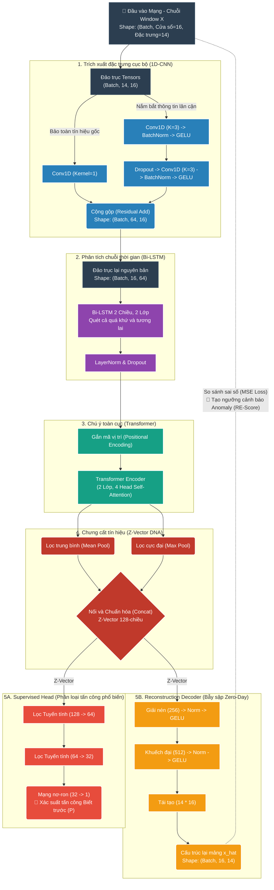

# 🏛️ KIẾN TRÚC MẠNG NƠ-RON (Hybrid Zero-Day Detector V5.0)

Sơ đồ mô phỏng đường đi của tín hiệu vào từ lớp Đầu vào (Input) xuyên qua các cổng trích xuất đặc trưng (Encoder) để tạo thành `Z-Vector`, sau đó được rẽ thành 2 nhánh phân tích tấn công (Supervised Head và Unsupervised Decoder) dành cho phân tích rủi ro bất thường.



---

# ⚙️ TOÀN CẢNH QUY TRÌNH HUẤN LUYỆN (End-to-End Training Flow)

Tái hiện luồng dữ liệu bắt đầu từ chia chẻ Data, tự động giam giữ dữ liệu Zero-Day, tới quá trình bơm dữ liệu vào DataLoader và tính toán các Loss Function.

```mermaid
flowchart TD
    classDef raw fill:#2c3e50,stroke:#34495e,stroke-width:2px,color:#fff
    classDef split fill:#f39c12,stroke:#fff,stroke-width:2px,color:#fff
    classDef model fill:#2980b9,stroke:#fff,stroke-width:2px,color:#fff
    classDef loss fill:#e74c3c,stroke:#fff,stroke-width:2px,color:#fff
    classDef opt fill:#27ae60,stroke:#fff,stroke-width:2px,color:#fff
    classDef zero fill:#8e44ad,stroke:#fff,stroke-width:2px,color:#fff

    A[(Dữ liệu Mạng CIC-IDS2017<br>2.8 Triệu gói tin)]:::raw --> B{Cổng Phân Tách Dữ Liệu<br>(Zero-Day Isolation Rules)}:::split
    
    B -- "Dấu hiệu Cực dị/Lạ\n(Bot, Web, Infiltration...)" --> ZD["Giam lỏng 100% vào TẬP TEST 🔒<br>(Bắt mô hình phải mò mẫm tự phát hiện)"]:::zero
    B -- "Băng thông sạch (Benign) & \nMẫu tấn công cũ (DDoS...)" --> TR["Khởi tạo: TẬP TRAIN & VAL 🛠️"]:::raw
    
    TR --> |Bootstrapping trọng số Over-sampling| D["FastWindowDataset<br>Cắt cửa sổ 16 Packets (Tránh OOM)"]:::split
    
    D --> |"Tensor Nhồi Model: (Batch, 16, 14)"| Model
    
    subgraph Model ["Bộ Không Gian Nơ-ron (Model Forward Pass)"]
        direction TB
        E["Encoder (1D-CNN + BiLSTM + Transformer/Attention)"]:::model --> F("Vector Z DNA"):::model
        F --> G["Head Cổng trên<br>(Phân loại tính chất)"]:::model
        F --> H["Decoder Cổng dưới<br>(Giải mã về bản gốc)"]:::model
    end
    
    G --> |"Đoán Xác suất tấn công P"| Loss1
    H --> |"Tái tạo dòng mạng ảo hóa X_hat"| Loss2
    D -. "Đáp án nhãn Y gốc" .-> Loss1
    D -. "Dòng mạng X gốc" .-> Loss2

    subgraph Loss ["Tính Điểm Phạt (Combined Loss Backprop)"]
        direction TB
        Loss1["🔪 Focal Loss<br>(Tính theo biến thiên của hàm Logit)"]:::loss
        Loss2["🔍 MSE Loss<br>(Tính độ dị biệt so với Benign)"]:::loss
        Loss1 --> Sum("TỔNG LOSS = Focal_Loss + (0.2 * MSE_Loss)"):::loss
        Loss2 --> Sum
    end
    
    Sum --> Opt["⚡ AdamW Optimizer & AMP<br>(Cập nhật Gradient lộn ngược + AutoCast)"]:::opt
    Opt -. "Hoàn thành Batch -> Đi tới Batch/Epoch Tiếp THEO" .-> D
```
